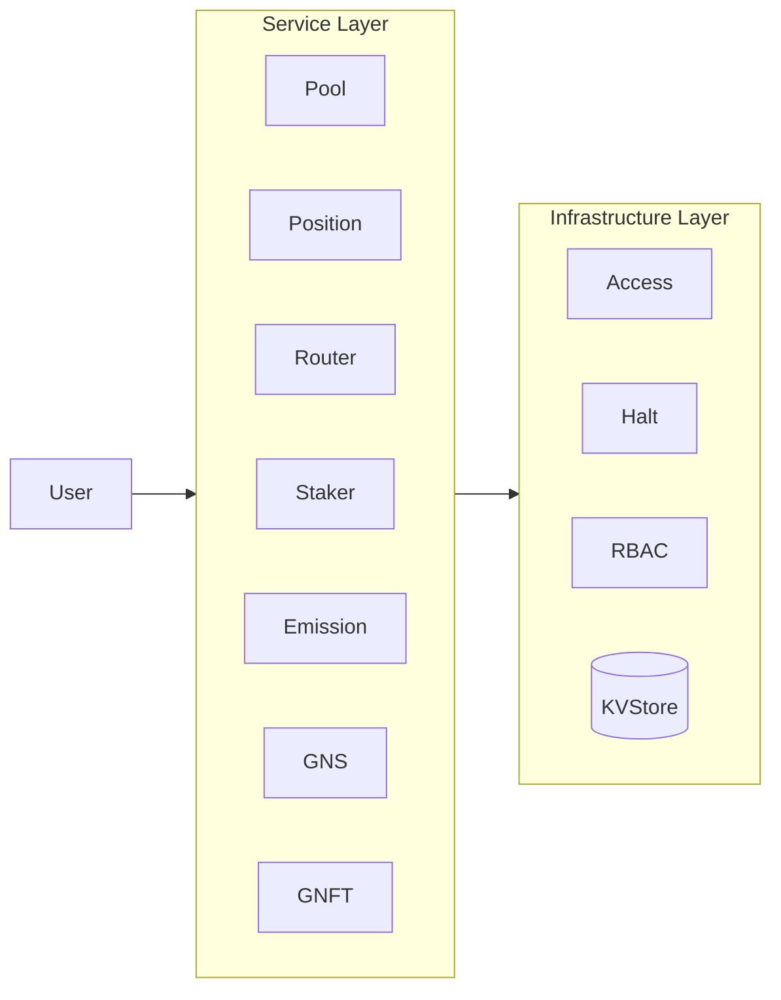

# GnoSwap Architecture Document

> Upgradeable Concentrated Liquidity AMM with Runtime Version Management

---

## Table of Contents

1. [Overview](./architecture/01-overview.md)
2. [Core Contracts](./architecture/02-core-contracts.md)
3. [Layer Architecture](./architecture/03-layer-architecture.md)
4. [Feature Flows](./architecture/04-feature-flows.md)
5. [Reward Distribution](./architecture/05-reward-distribution.md)
6. [Appendix](./architecture/06-appendix.md)

---

## Quick Overview

### What is GnoSwap?

GnoSwap is a **Concentrated Liquidity AMM** built on the Gno blockchain. Based on the Uniswap V3 concentrated liquidity model, it provides an upgradeable architecture that leverages the characteristics of the Gno chain.

**Key Features:**

- **Concentrated Liquidity**: LPs can concentrate capital within specific price ranges, achieving up to 4000x capital efficiency compared to traditional AMMs.
- **Upgradeable Architecture**: Contract logic can be upgraded without service interruption through the Version Manager pattern.
- **Integrated Reward System**: Unified management of GNS token emission and external incentives.
- **NFT-based Positions**: Each liquidity position is represented as a unique NFT.

### System Architecture

GnoSwap consists of a 2-layer architecture:



- **Service Layer**: Domain contracts that process business logic
- **Infrastructure Layer**: Base services for data storage, permission management, and emergency halt

### Core Contracts

| Contract | Role | Upgradeable |
|----------|------|-------------|
| [Pool](./architecture/02-core-contracts.md#22-pool-contract) | Concentrated liquidity AMM core logic | Yes |
| [Position](./architecture/02-core-contracts.md#23-position-contract) | LP position NFT management | Yes |
| [Router](./architecture/02-core-contracts.md#24-router-contract) | Multi-hop swap routing | Yes |
| [Staker](./architecture/02-core-contracts.md#25-staker-contract) | Liquidity mining rewards | Yes |
| Emission | GNS emission schedule | No |
| GNS | Governance token (GRC20) | No |
| GNFT | Position NFT (GRC721) | No |
| Access | Role-based permission management | No |
| Halt | Emergency halt system | No |

### Feature Flows

- [Version Upgrade Flow](./architecture/04-feature-flows.md#41-version-upgrade-flow)
- [Pool Creation Flow](./architecture/04-feature-flows.md#42-pool-creation-flow)
- [Position Mint Flow](./architecture/04-feature-flows.md#43-position-mint-flow)
- [Swap Execution Flow](./architecture/04-feature-flows.md#44-swap-execution-flow)
- [Staking Flow](./architecture/04-feature-flows.md#45-staking-flow)
- [Collect Reward Flow](./architecture/04-feature-flows.md#46-collect-reward-flow)
- [Unstake Flow](./architecture/04-feature-flows.md#47-unstake-flow)

### Reward Distribution

GnoSwap's reward system provides rewards from two sources:

- **Internal Rewards (GNS)**: Issued from Emission contract, distributed based on Pool Tier
- **External Incentives**: Custom token rewards for specific pools

See [Reward Distribution](./architecture/05-reward-distribution.md) for details.

---

## Directory Structure

```
contract/
├── p/gnoswap/                  # Packages (stateless)
│   ├── int256/, uint256/       # Big number operations
│   ├── gnsmath/                # Swap math operations
│   ├── store/                  # KVStore abstraction
│   └── version_manager/        # Version management system
│
└── r/gnoswap/                  # Realms (stateful)
    ├── pool/                   # AMM pools
    ├── position/               # Position management
    ├── router/                 # Swap routing
    ├── staker/                 # Reward system
    ├── emission/               # Token emission
    ├── gns/                    # GNS token
    ├── gnft/                   # Position NFT
    ├── access/                 # Permission management
    └── halt/                   # Emergency halt
```

---

*GnoSwap Architecture Document v1.0*
