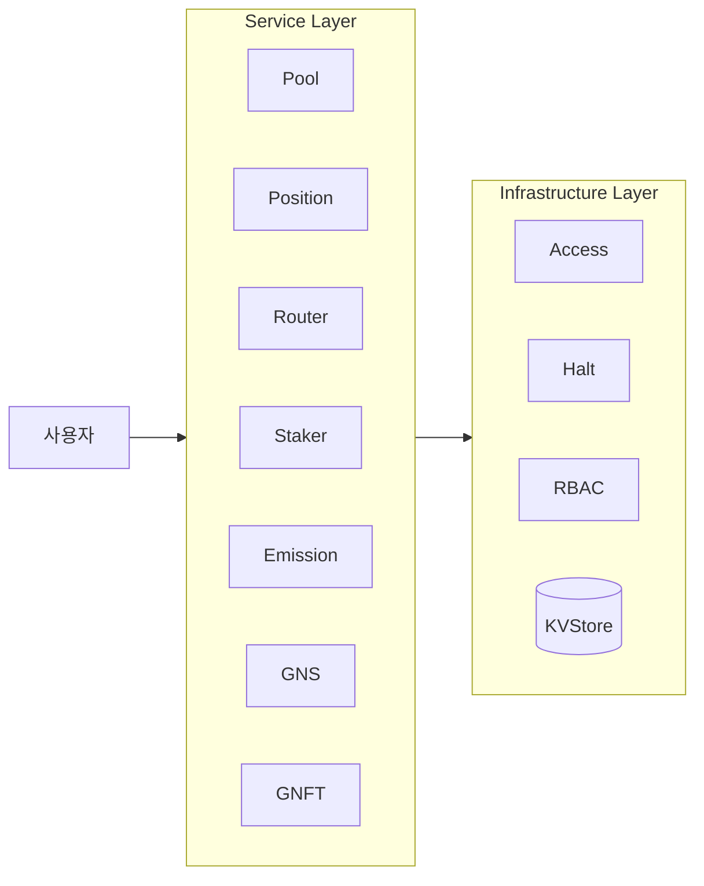
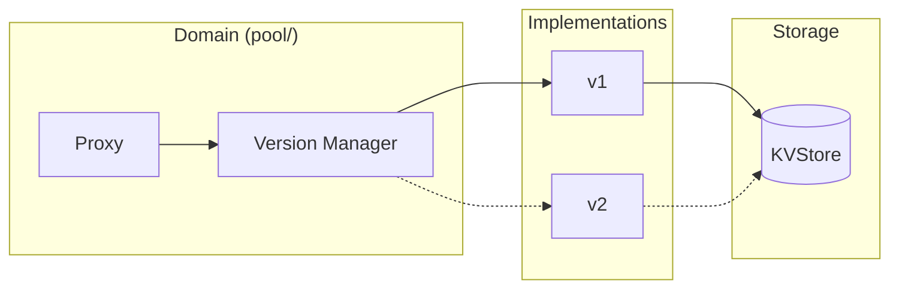

# 1. Overview

## 1.1 GnoSwap이란?

GnoSwap은 Gno 블록체인 위에 구축된 **Concentrated Liquidity AMM**입니다. Uniswap V3의 집중 유동성 모델을 기반으로 하며, Gno 체인의 특성을 활용한 업그레이드 가능한 아키텍처를 제공합니다.

**핵심 특징:**

- **집중 유동성 (Concentrated Liquidity)**: 유동성 제공자(LP)가 특정 가격 범위에 자본을 집중하여 자본 효율성을 극대화합니다. 전통적인 AMM 대비 최대 4000배의 자본 효율성을 달성할 수 있습니다.

- **업그레이드 가능한 아키텍처**: Version Manager 패턴을 통해 서비스 중단 없이 컨트랙트 로직을 업그레이드할 수 있습니다. 데이터 마이그레이션 없이 새 버전으로 즉시 전환됩니다.

- **통합 리워드 시스템**: GNS 토큰 이미션과 외부 인센티브를 통합 관리합니다. LP는 스왑 수수료 외에도 추가 리워드를 획득할 수 있습니다.

- **NFT 기반 포지션**: 각 유동성 포지션이 고유한 NFT로 표현되어 개별 관리, 전송, 담보 활용이 가능합니다.

## 1.2 System Architecture

GnoSwap은 2계층 아키텍처로 구성됩니다. 사용자 요청은 Service Layer의 컨트랙트를 통해 처리되며, Infrastructure Layer의 기반 서비스를 활용합니다.



**아키텍처 설명:**

- **Service Layer**: 비즈니스 로직을 처리하는 도메인 컨트랙트들입니다. 사용자 요청을 처리하고, 각 도메인의 핵심 기능을 제공합니다.

- **Infrastructure Layer**: 기반 서비스를 제공합니다. 데이터 저장, 권한 관리, 비상 정지 등 모든 Service에서 공통으로 사용하는 기능을 담당합니다.

## 1.3 Directory Structure

```
contract/
├── p/gnoswap/                  # Packages (상태 없음)
│   ├── int256/, uint256/       # Big number 연산
│   ├── gnsmath/                # 스왑 수학 연산
│   ├── store/                  # KVStore 추상화
│   └── version_manager/        # 버전 관리 시스템
│
└── r/gnoswap/                  # Realms (상태 있음)
    ├── pool/                   # AMM 풀
    │   ├── pool.gno            # Proxy 인터페이스
    │   └── v1/                 # Implementation
    ├── position/               # 포지션 관리
    ├── router/                 # 스왑 라우팅
    ├── staker/                 # 리워드 시스템
    ├── emission/               # 토큰 발행
    ├── gns/                    # GNS 토큰
    ├── gnft/                   # 포지션 NFT
    ├── access/                 # 권한 관리
    └── halt/                   # 비상 정지
```

**Packages vs Realms:**

- **Packages (p/)**: 상태를 가지지 않는 순수 라이브러리입니다. 수학 연산, 유틸리티 함수 등을 제공합니다.

- **Realms (r/)**: 상태를 가지는 스마트 컨트랙트입니다. 실제 비즈니스 로직과 데이터를 관리합니다.

## 1.4 Version Manager Pattern

GnoSwap의 핵심 설계 패턴은 무중단 업그레이드를 가능하게 하는 Version Manager입니다.



**동작 원리:**

1. **Proxy Layer**: 안정적인 공개 인터페이스를 제공합니다. 외부에서 보는 API는 변경되지 않습니다.

2. **Version Manager**: 현재 활성화된 구현체를 추적하고, 버전 전환을 관리합니다.

3. **Implementation Layer**: 실제 비즈니스 로직이 구현된 버전별 패키지입니다. v1, v2 등 여러 버전이 공존할 수 있습니다.

4. **Storage Layer**: 모든 버전이 공유하는 단일 KVStore입니다. 버전 전환 시 데이터 마이그레이션이 필요 없습니다.

**업그레이드 과정:**

```
1. 새 버전(v2) 배포 및 등록
2. Admin이 ChangeImplementation("pool/v2") 호출
3. Version Manager가 현재 구현체 포인터를 v2로 변경
4. 즉시 v2 로직이 활성화 (무중단)
```
