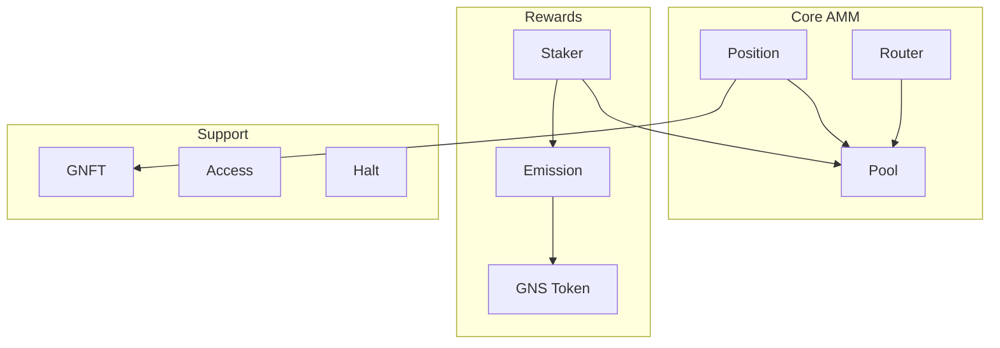

# 2. Core Contracts

## 2.1 Contract Overview

GnoSwap은 역할에 따라 명확하게 분리된 컨트랙트들로 구성됩니다.



| 컨트랙트 | 역할 | 업그레이드 |
|----------|------|------------|
| Pool | 집중 유동성 AMM 핵심 로직 | Yes |
| Position | LP 포지션 NFT 관리 | Yes |
| Router | 멀티홉 스왑 라우팅 | Yes |
| Staker | 유동성 마이닝 리워드 | Yes |
| Emission | GNS 발행 스케줄 | No |
| GNS | 거버넌스 토큰 (GRC20) | No |
| GNFT | 포지션 NFT (GRC721) | No |
| Access | 역할 기반 권한 관리 | No |
| Halt | 비상 정지 시스템 | No |

## 2.2 Pool Contract

Pool 컨트랙트는 GnoSwap의 핵심으로, 집중 유동성 AMM의 모든 로직을 처리합니다.

**책임:**

- 풀 생성 및 초기화
- 틱 기반 유동성 관리
- 스왑 실행 및 가격 계산
- 수수료 누적 및 분배
- TWAP 오라클 데이터 관리

**주요 함수:**

| 함수 | 설명 | 호출자 |
|------|------|--------|
| CreatePool | 새 거래 쌍 풀 생성 | User |
| Mint | 유동성 추가 | Position |
| Burn | 유동성 제거 | Position |
| Swap | 토큰 교환 | Router |
| Collect | 수수료/원금 수집 | Position |

**풀 상태 데이터:**

```
Pool State
├── sqrtPriceX96      현재 가격 (Q64.96 형식)
├── tick              현재 틱 인덱스
├── liquidity         현재 가격 범위의 활성 유동성
├── feeGrowthGlobal   글로벌 수수료 누적값
├── ticks             틱별 유동성 정보 (AVL Tree)
├── positions         포지션별 상태 (AVL Tree)
└── observations      TWAP 오라클 데이터
```

**Fee Tiers:**

풀은 4가지 수수료 티어 중 하나로 생성됩니다. 높은 수수료는 변동성이 큰 페어에 적합합니다.

| Fee | Tick Spacing | 용도 |
|-----|--------------|------|
| 0.01% (100) | 1 | 스테이블코인 페어 |
| 0.05% (500) | 10 | 안정적 페어 |
| 0.3% (3000) | 60 | 일반 페어 |
| 1% (10000) | 200 | 변동성 큰 페어 |

## 2.3 Position Contract

Position 컨트랙트는 사용자의 유동성 포지션을 NFT로 관리합니다.

**책임:**

- 유동성 포지션 생성/수정/삭제
- 포지션 NFT 발행 및 메타데이터 관리
- 누적 수수료 수집 처리
- 포지션 재배치 (가격 범위 변경)

**주요 함수:**

| 함수 | 설명 |
|------|------|
| Mint | 새 포지션 생성, NFT 발행 |
| IncreaseLiquidity | 기존 포지션에 유동성 추가 |
| DecreaseLiquidity | 포지션에서 유동성 제거 |
| CollectFee | 누적 수수료 수집 |
| Reposition | 가격 범위 변경 |

**포지션 데이터:**

각 포지션은 고유한 NFT ID를 가지며, 다음 정보를 포함합니다:

```
Position
├── tokenId           NFT ID
├── owner             소유자 주소
├── token0, token1    풀 토큰 쌍
├── fee               수수료 티어
├── tickLower         하한 가격 틱
├── tickUpper         상한 가격 틱
├── liquidity         유동성량
└── tokensOwed        미수령 토큰
```

## 2.4 Router Contract

Router 컨트랙트는 최적의 경로로 스왑을 실행합니다.

**책임:**

- 스왑 경로 파싱 및 검증
- 멀티홉 스왑 실행
- 슬리피지 보호
- Native GNOT 래핑/언래핑

**주요 함수:**

| 함수 | 설명 |
|------|------|
| ExactInSwapRoute | 입력량 고정 스왑 |
| ExactOutSwapRoute | 출력량 고정 스왑 |
| DrySwapRoute | 스왑 시뮬레이션 (상태 변경 없음) |

**Route Format:**

```
# Single-hop
"tokenIn:tokenOut:fee"
예: "gno.land/r/demo/bar:gno.land/r/demo/baz:3000"

# Multi-hop
"token1:token2:fee1*POOL*token2:token3:fee2"
예: "bar:baz:3000*POOL*baz:qux:500"

# Quote (경로별 비율)
"30,70"  → 첫 경로 30%, 두번째 경로 70%
```

## 2.5 Staker Contract

Staker 컨트랙트는 유동성 마이닝 리워드를 관리합니다.

**책임:**

- 포지션 스테이킹/언스테이킹
- 내부 리워드 (GNS) 계산 및 분배
- 외부 인센티브 관리
- 풀 티어 기반 리워드 배분

**주요 함수:**

| 함수 | 설명 |
|------|------|
| StakeToken | 포지션 NFT 스테이킹 |
| UnStakeToken | 언스테이킹 및 리워드 수령 |
| CollectReward | 리워드만 수령 (스테이킹 유지) |
| MintAndStake | 포지션 생성 + 스테이킹 원샷 |
| CreateExternalIncentive | 외부 리워드 풀 생성 |

**리워드 유형:**

1. **Internal Rewards (GNS)**: Emission에서 발행된 GNS가 풀 티어에 따라 분배됩니다.

2. **External Incentives**: 누구나 특정 풀에 커스텀 토큰 리워드를 설정할 수 있습니다.

**Pool Tier System:**

풀은 1~10 티어로 분류되며, 높은 티어일수록 더 많은 GNS 리워드를 받습니다.

## 2.6 Supporting Contracts

**GNS Token:**

GnoSwap의 거버넌스 토큰입니다. GRC20 표준을 따르며, Emission 컨트랙트만 발행할 수 있습니다.

- 초기 발행: 100조 GNS
- 최대 공급량: 1,000조 GNS
- 발행 기간: 12년 (반감기 적용)

**GNFT:**

포지션 NFT 컨트랙트입니다. GRC721 표준을 따르며, 동적 SVG 메타데이터를 생성합니다.

**Access:**

역할 기반 권한 관리 시스템입니다. admin, governance, pool, position 등 역할별 주소를 관리합니다.

**Halt:**

비상 정지 시스템으로 4단계 halt 레벨을 지원합니다:

| Level | 설명 |
|-------|------|
| None | 정상 운영 |
| SafeMode | 핵심 작업만 허용 |
| Emergency | 출금만 허용 |
| Complete | 모든 작업 정지 |
