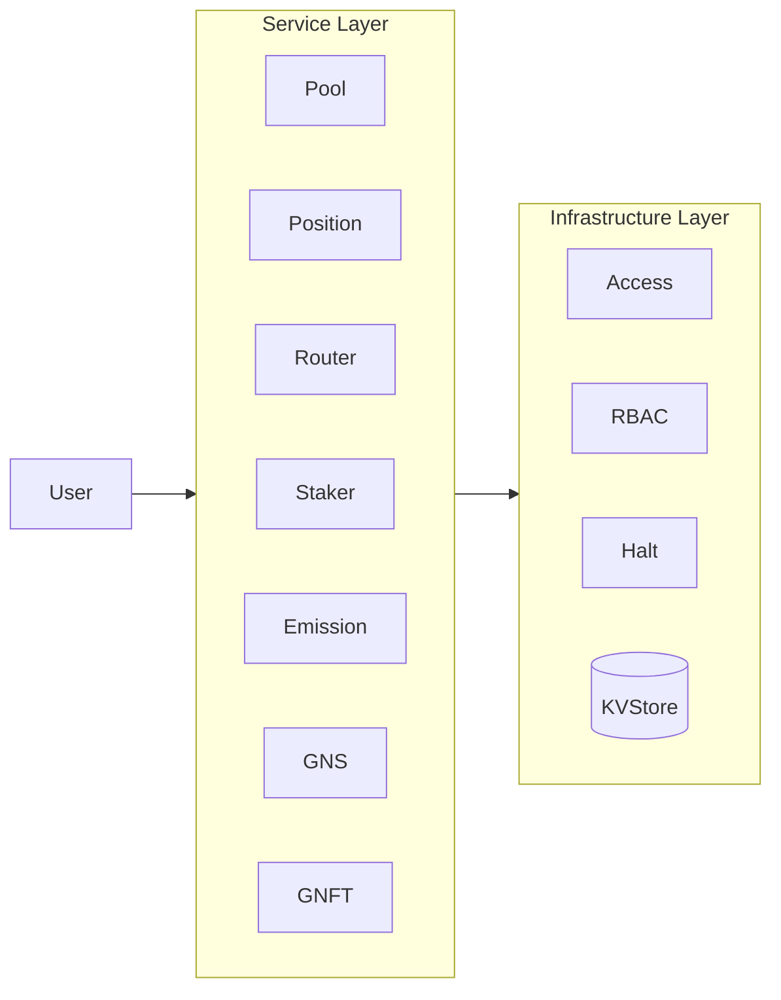
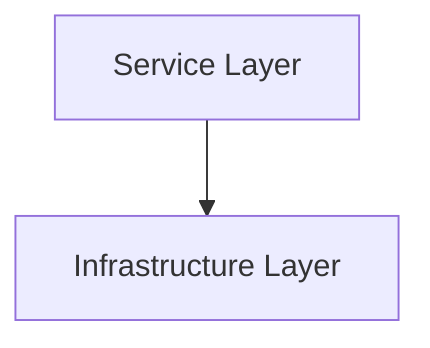
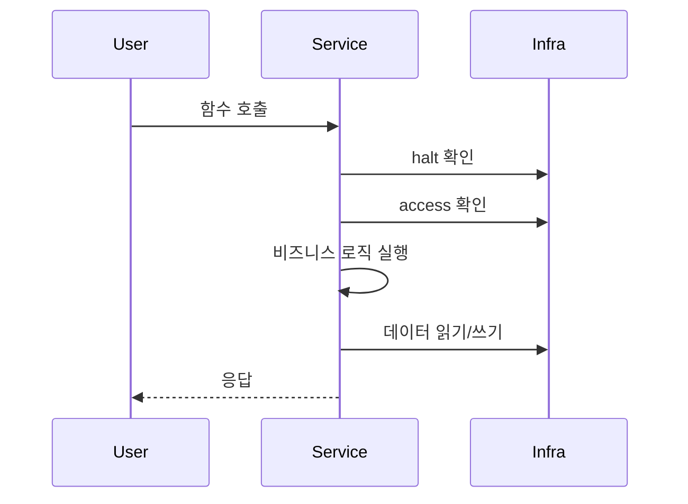

# 3. Layer Architecture

## 3.1 Two-Layer Structure

GnoSwap은 Service와 Infrastructure의 2계층 아키텍처를 사용합니다. 각 레이어는 명확한 책임을 가지며, Service Layer는 Infrastructure Layer에 의존합니다.

## 3.2 Service Layer

Service Layer는 비즈니스 로직을 처리하는 도메인 컨트랙트들로 구성됩니다.

| 컨트랙트 | 책임 |
|----------|------|
| Pool | 집중 유동성 풀 관리, 스왑 실행, 수수료 누적 |
| Position | LP 포지션 CRUD, NFT 발행, 수수료 수집 |
| Router | 스왑 경로 파싱, 멀티홉 실행, 슬리피지 검증 |
| Staker | 스테이킹 관리, 리워드 계산, 외부 인센티브 |
| Emission | GNS 발행 스케줄 관리, 분배 비율 계산 |
| GNS | GNS 토큰 발행/전송/소각 |
| GNFT | 포지션 NFT 발행/소각, 메타데이터 관리 |

**특징:**

- 사용자 요청의 진입점
- 도메인별 비즈니스 로직 구현
- 다른 Service 컨트랙트와 상호작용
- Infrastructure 서비스 활용

## 3.3 Infrastructure Layer

Infrastructure Layer는 모든 Service에서 공통으로 사용하는 기반 서비스를 제공합니다.

| 컴포넌트 | 책임 |
|----------|------|
| Access | 역할 기반 접근 제어 |
| RBAC | 역할 주소 관리 |
| Halt | 비상 정지 시스템 |
| KVStore | 영속 데이터 저장소 |

**특징:**

- 모든 Service에서 공통으로 사용
- 보안 및 안정성 기반 제공
- 도메인 로직과 독립적
- 상위 레이어를 알지 못함 (단방향 의존성)

## 3.4 Layer Dependencies

**의존성 규칙:**

1. Service Layer는 Infrastructure Layer의 데이터와 서비스를 사용합니다.
2. Infrastructure Layer는 Service Layer를 알지 못합니다.
3. Service Layer 내 컨트랙트 간 상호 호출이 가능합니다.

## 3.5 Data Flow

사용자 요청이 처리되는 전형적인 흐름입니다:

**처리 단계:**

1. **Service Layer**: 사용자 요청 수신, halt/access 확인, 비즈니스 로직 실행
2. **Infrastructure Layer**: 권한 검증, 데이터 영속화
3. **응답**: 결과를 사용자에게 반환
