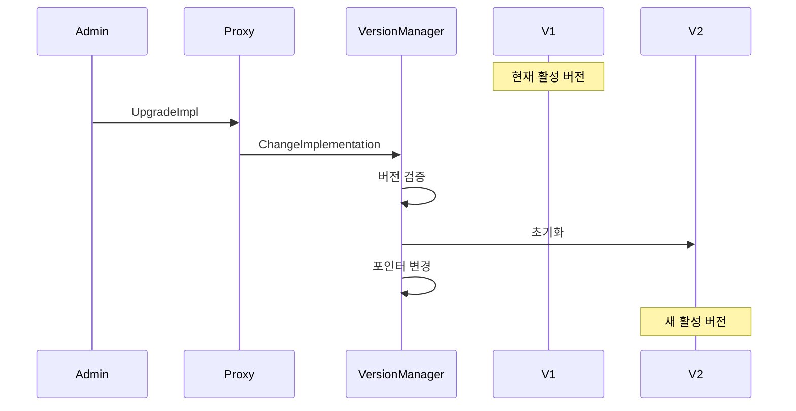
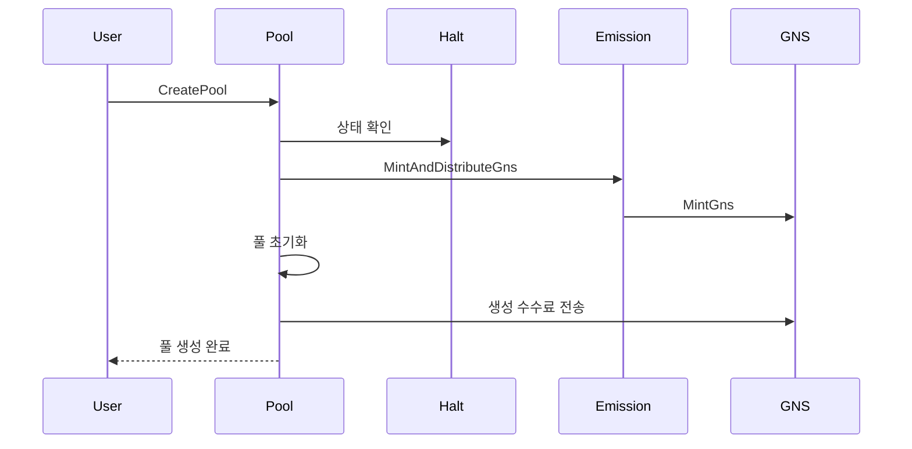
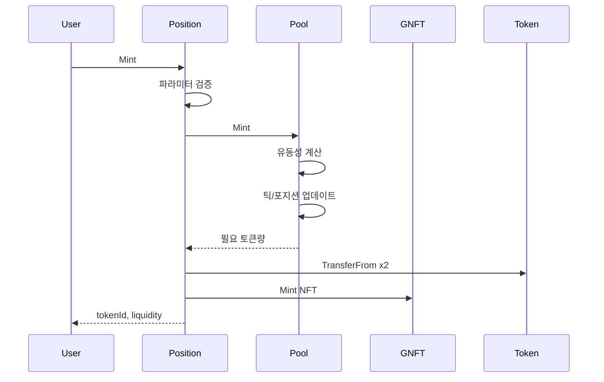
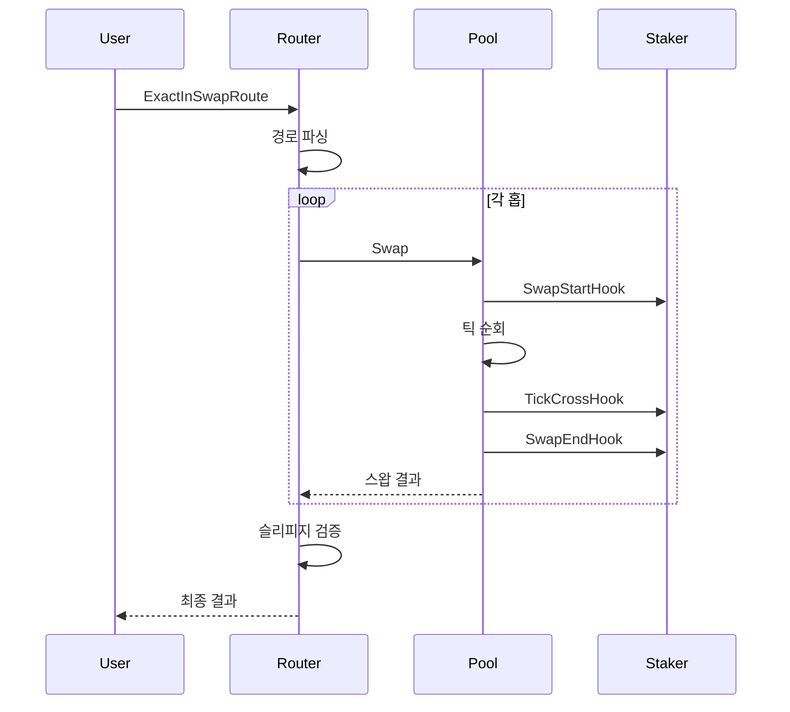
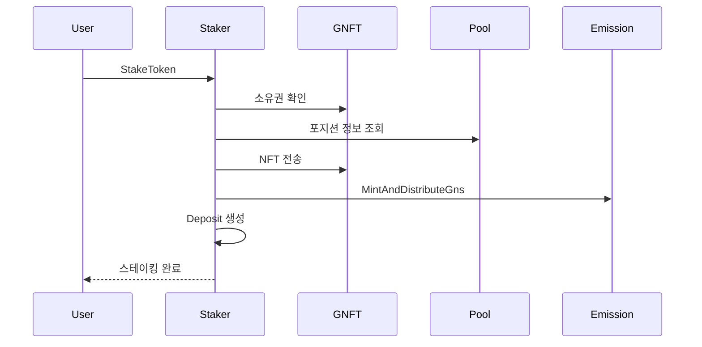
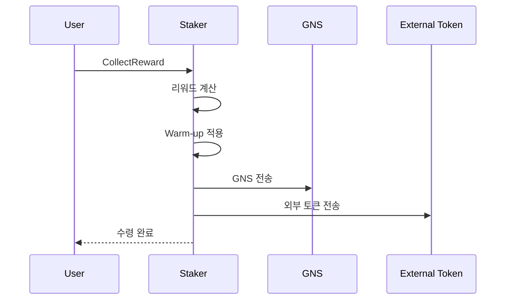
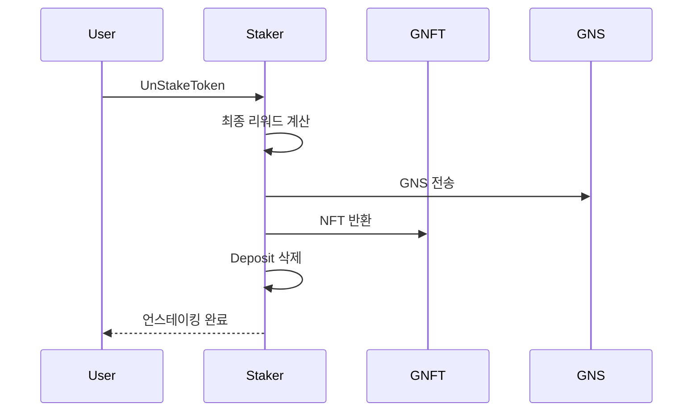

# 4. Feature Flows

## 4.1 Version Upgrade Flow

컨트랙트 업그레이드는 서비스 중단 없이 진행됩니다.



**업그레이드 과정:**

1. Admin이 새 버전 패키지 경로로 `UpgradeImpl` 호출
2. Version Manager가 해당 버전이 등록되어 있는지 확인
3. 새 버전의 initializer 실행 (동일 KVStore 사용)
4. `currentImplementation` 포인터를 새 버전으로 변경
5. 이후 모든 호출은 새 버전으로 라우팅

**특징:**

- 데이터 마이그레이션 불필요 (동일 스토리지)
- 즉시 적용 (무중단)
- 이전 버전으로 롤백 가능

## 4.2 Pool Creation Flow

새로운 거래 쌍 풀을 생성하는 과정입니다.



**생성 과정:**

1. 사용자가 token0, token1, fee, 초기 가격으로 `CreatePool` 호출
2. Halt 상태 확인 (정지 상태면 실패)
3. Emission 트리거 (GNS 발행 및 분배)
4. 풀 구조체 초기화:
   - 토큰 순서 정렬 (token0 < token1)
   - sqrtPriceX96에서 초기 tick 계산
   - ticks, positions AVL Tree 초기화
5. 풀 생성 수수료 (100 GNS) 전송
6. 풀을 pools 맵에 저장

**요구사항:**

- 두 토큰 모두 GRC20 레지스트리에 등록되어야 함
- 동일 토큰 쌍 + 수수료 조합의 풀은 하나만 존재
- 생성자가 100 GNS를 보유해야 함

## 4.3 Position Mint Flow

새로운 유동성 포지션을 생성하는 과정입니다.



**생성 과정:**

1. 사용자가 풀, 가격 범위, 희망 토큰량으로 `Mint` 호출
2. tick spacing 검증 (fee tier에 맞는 간격인지)
3. Pool.Mint 호출:
   - 토큰량에서 최대 유동성 계산
   - tick bitmap 업데이트
   - position state 업데이트
   - 실제 필요한 토큰량 반환
4. 사용자로부터 token0, token1 전송
5. GNFT NFT 발행 (동적 SVG 메타데이터)
6. tokenId, liquidity, 실제 사용 토큰량 반환

**포지션 특성:**

- 각 포지션은 고유한 NFT ID 보유
- 가격 범위 (tickLower, tickUpper)는 변경 불가
- 유동성 추가/제거는 별도 함수로 처리

## 4.4 Swap Execution Flow

토큰 스왑이 실행되는 과정입니다.



**스왑 과정:**

1. 사용자가 입력 토큰, 출력 토큰, 경로, 최소 출력량으로 호출
2. Router가 경로 문자열 파싱 (멀티홉 지원)
3. 각 홉에 대해 Pool.Swap 실행:
   - Reentrancy 락 획득
   - SwapStartHook → Staker에 배치 시작 알림
   - 틱 순회하며 유동성 소비, 가격 업데이트
   - 틱 경계 통과 시 TickCrossHook 호출
   - SwapEndHook → Staker에 배치 종료 알림
   - 콜백으로 토큰 전송 처리
4. 최종 출력량이 최소치 이상인지 확인
5. 결과 반환

**Hook 시스템:**

Pool 스왑 중 Staker에 이벤트를 알려 리워드 계산을 업데이트합니다:

- `SwapStartHook`: 배치 처리 초기화
- `TickCrossHook`: 틱 경계 통과 시 누적값 업데이트
- `SwapEndHook`: 배치 처리 완료

## 4.5 Staking Flow

포지션을 스테이킹하여 리워드를 받는 과정입니다.



**스테이킹 과정:**

1. 사용자가 positionId로 `StakeToken` 호출
2. GNFT에서 소유권 확인
3. Pool에서 포지션 정보 조회 (liquidity, ticks)
4. NFT를 Staker 컨트랙트로 전송
5. Emission 트리거 (GNS 발행)
6. Deposit 생성:
   - lpTokenId, targetPoolPath
   - liquidity, tick 범위
   - stakeTimestamp (warm-up 계산용)
   - 리워드 누적기 초기화
7. 스테이킹 완료 이벤트 발행

**Deposit 데이터:**

```
Deposit
├── lpTokenId         포지션 NFT ID
├── targetPoolPath    스테이킹된 풀
├── liquidity         유동성량
├── tickLower/Upper   가격 범위
├── stakeTimestamp    스테이킹 시작 시간
└── rewardState       리워드 누적 상태
```

## 4.6 Collect Reward Flow

스테이킹 리워드를 수집하는 과정입니다.



**리워드 계산:**

1. 글로벌 누적 리워드 조회
2. 포지션의 가격 범위 내 누적 리워드 계산
3. 포지션 유동성 비율 적용
4. 이전 수집분 차감
5. Warm-up 비율 적용 (스테이킹 기간에 따라)
6. GNS 및 외부 토큰 전송
7. lastCollectionTime 업데이트

**Warm-up Period:**

신규 스테이커의 게이밍 방지를 위해 스테이킹 기간에 따라 리워드 비율이 증가합니다:

| 기간   | 리워드 비율 |
| ------ | ----------- |
| 0일    | 30%         |
| 1-7일  | 50%         |
| 7-14일 | 70%         |
| 14일+  | 100%        |

## 4.7 Unstake Flow

스테이킹을 해제하고 포지션을 회수하는 과정입니다.



**언스테이킹 과정:**

1. 최종 리워드 계산 및 전송 (GNS + 외부 토큰)
2. NFT를 사용자에게 반환
3. Deposit 데이터 삭제
4. 언스테이킹 완료 이벤트 발행

**이후 사용자 작업:**

언스테이킹 후 유동성을 회수하려면:

1. `Position.DecreaseLiquidity` - 유동성 제거
2. `Position.CollectFee` - 토큰 및 수수료 수령
