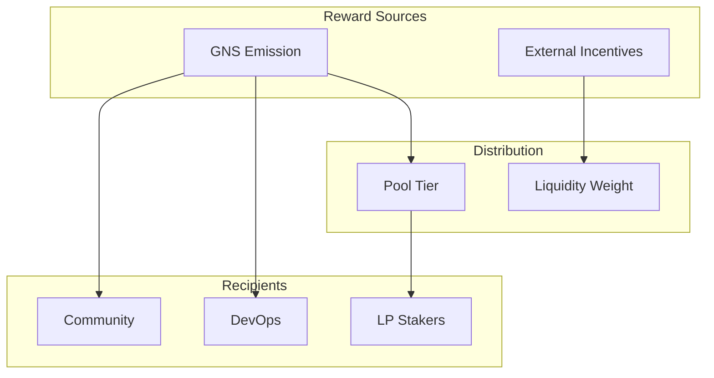
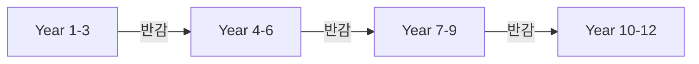
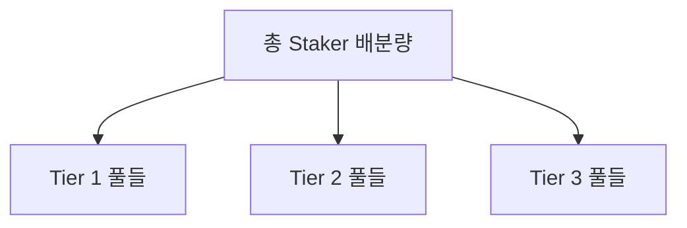
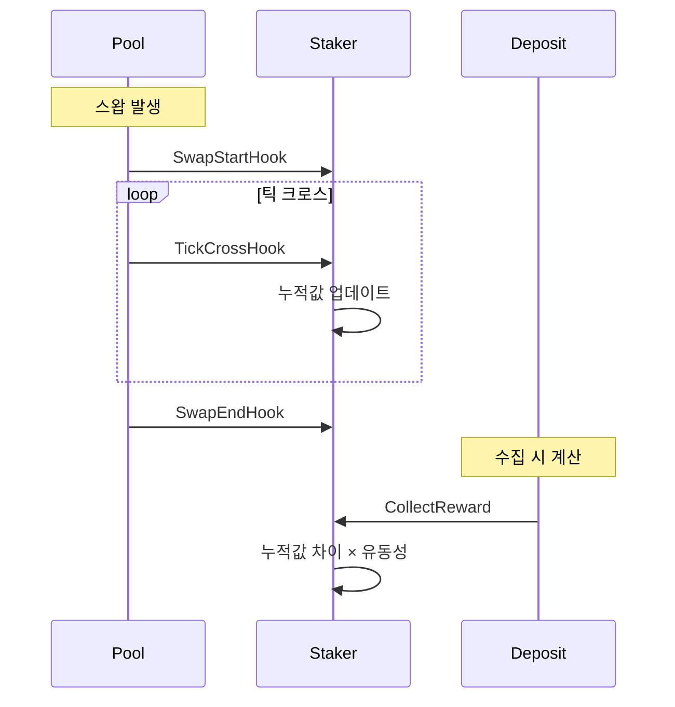
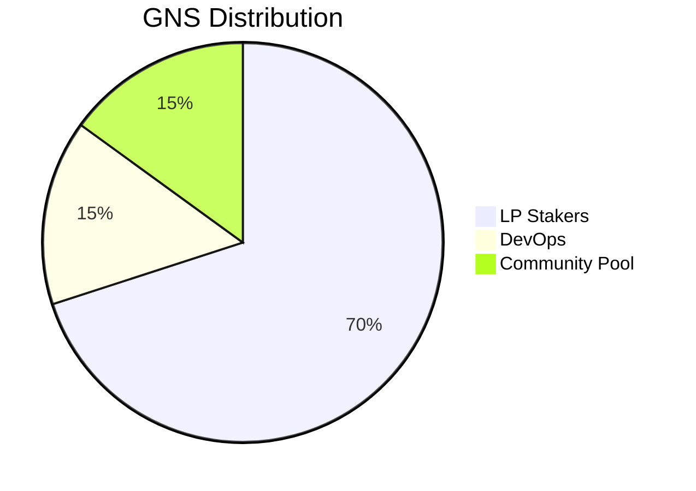
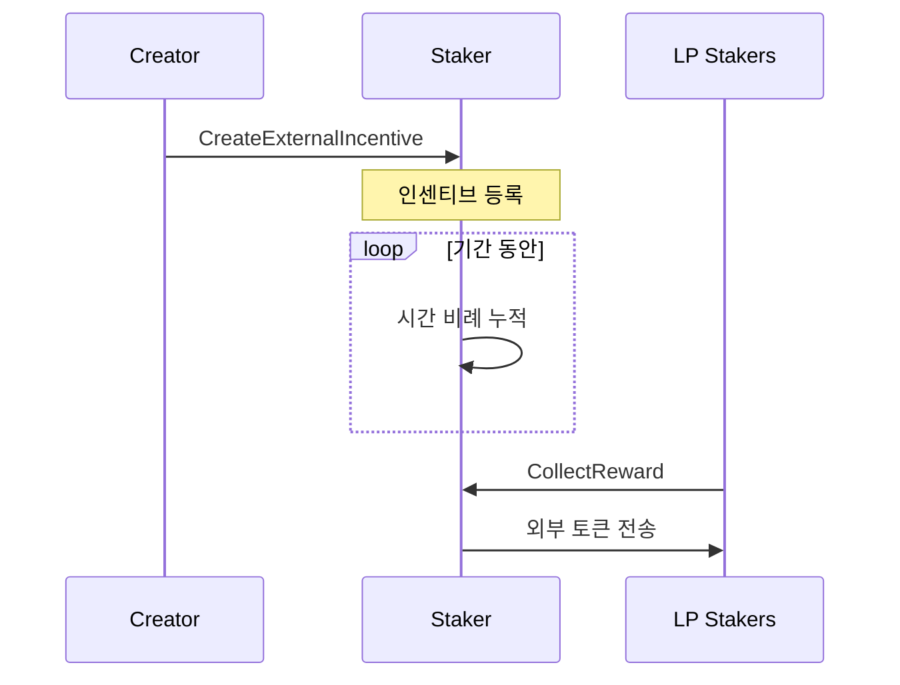

# 5. Reward Distribution

## 5.1 Reward System Overview

GnoSwap의 리워드 시스템은 두 가지 소스에서 보상을 제공합니다.



**Internal Rewards (GNS):**

- Emission 컨트랙트에서 스케줄에 따라 발행
- Pool Tier에 따라 풀별 배분
- 유동성 비율로 스테이커별 배분

**External Incentives:**

- 누구나 특정 풀에 커스텀 토큰 리워드 설정 가능
- 지정 기간 동안 균등 분배
- 유동성 비율로 스테이커별 배분

## 5.2 GNS Emission Schedule

GNS는 12년에 걸쳐 반감기를 적용하여 발행됩니다.



| 구분 | 수량 |
|------|------|
| Initial Mint | 100조 GNS |
| Emission Pool | 900조 GNS |
| Maximum Supply | 1,000조 GNS |
| Duration | 12년 |
| Halving | ~3년마다 |

**발행 특성:**

- 매 블록/트랜잭션마다 시간 비례 발행
- 반감기마다 초당 발행량 50% 감소
- 미분배분은 다음 분배 시 이월

## 5.3 Pool Tier System

풀은 티어에 따라 GNS 리워드를 차등 배분받습니다.



**티어 구조:**

| Tier | 설명 | 리워드 비중 |
|------|------|-------------|
| Tier 1 | 핵심 페어 | 최고 |
| Tier 2 | 주요 페어 | 중간 |
| Tier 3 | 일반 페어 | 낮음 |

**배분 로직:**

1. 총 Staker 배분량 결정 (Emission에서)
2. 티어별 가중치에 따라 배분량 할당
3. 각 티어 내 풀들은 균등 배분
4. 풀 내 스테이커는 유동성 비율로 배분

## 5.4 Reward Calculation

스왑 발생 시 리워드 누적기가 업데이트됩니다.



**계산 공식:**

```
개인 리워드 = (현재 누적값 - 이전 누적값) × 유동성 × warm-up 비율
```

**누적기 업데이트:**

- `rewardPerLiquidityGlobal`: 전체 풀의 유동성당 리워드
- `rewardPerLiquidityInside`: 특정 가격 범위 내 리워드
- 틱 경계 통과 시 inside 값 재계산

## 5.5 Distribution Targets

GNS Emission은 여러 대상에게 분배됩니다.



| 대상 | 설명 | 분배 방식 |
|------|------|-----------|
| LP Stakers | 유동성 제공자 | 티어 × 유동성 비율 |
| DevOps | 개발/운영팀 | 고정 비율 |
| Community Pool | 커뮤니티 재원 | 고정 비율 |

**Protocol Fee 분배:**

스왑 수수료의 일부는 프로토콜 수수료로 수집됩니다:

- 스왑 수수료의 0-10% (설정 가능)
- DevOps와 Community Pool로 분배

## 5.6 External Incentives

외부 프로젝트가 특정 풀에 추가 리워드를 제공할 수 있습니다.



**인센티브 설정:**

| 파라미터 | 설명 |
|----------|------|
| targetPoolPath | 대상 풀 |
| rewardToken | 리워드 토큰 주소 |
| rewardAmount | 총 리워드량 |
| startTimestamp | 시작 시간 |
| endTimestamp | 종료 시간 |

**분배 방식:**

- 기간 동안 초당 균등 분배
- 유동성 비율로 스테이커별 배분
- 최소 리워드 임계값 적용 가능
