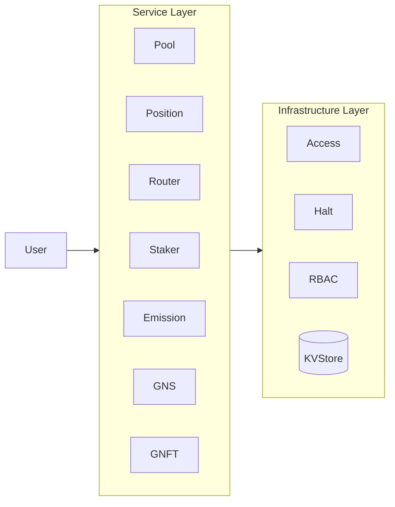
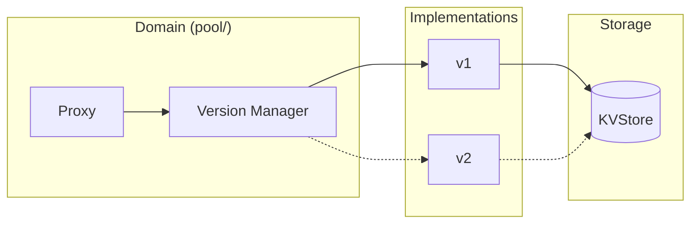

# 1. Overview

## 1.1 What is GnoSwap?

GnoSwap is a **Concentrated Liquidity AMM** built on the Gno blockchain. Based on the Uniswap V3 concentrated liquidity model, it provides an upgradeable architecture that leverages the characteristics of the Gno chain.

**Key Features:**

- **Concentrated Liquidity**: Liquidity providers (LPs) can concentrate their capital within specific price ranges to maximize capital efficiency. Up to 4000x capital efficiency can be achieved compared to traditional AMMs.

- **Upgradeable Architecture**: Through the Version Manager pattern, contract logic can be upgraded without service interruption. Instant transition to new versions without data migration.

- **Integrated Reward System**: Unified management of GNS token emission and external incentives. LPs can earn additional rewards beyond swap fees.

- **NFT-based Positions**: Each liquidity position is represented as a unique NFT, enabling individual management, transfer, and collateral utilization.

## 1.2 System Architecture

GnoSwap consists of a 2-layer architecture. User requests are processed through Service Layer contracts, utilizing Infrastructure Layer base services.



**Architecture Description:**

- **Service Layer**: Domain contracts that process business logic. They handle user requests and provide core functionality for each domain.

- **Infrastructure Layer**: Provides base services. Responsible for common functions used by all Services such as data storage, permission management, and emergency halt.

## 1.3 Directory Structure

```
contract/
├── p/gnoswap/                  # Packages (stateless)
│   ├── int256/, uint256/       # Big number operations
│   ├── gnsmath/                # Swap math operations
│   ├── store/                  # KVStore abstraction
│   └── version_manager/        # Version management system
│
└── r/gnoswap/                  # Realms (stateful)
    ├── pool/                   # AMM pools
    │   ├── pool.gno            # Proxy interface
    │   └── v1/                 # Implementation
    ├── position/               # Position management
    ├── router/                 # Swap routing
    ├── staker/                 # Reward system
    ├── emission/               # Token emission
    ├── gns/                    # GNS token
    ├── gnft/                   # Position NFT
    ├── access/                 # Permission management
    └── halt/                   # Emergency halt
```

**Packages vs Realms:**

- **Packages (p/)**: Pure libraries without state. Provide math operations, utility functions, etc.

- **Realms (r/)**: Smart contracts with state. Manage actual business logic and data.

## 1.4 Version Manager Pattern

The core design pattern of GnoSwap is the Version Manager that enables zero-downtime upgrades.



**How it Works:**

1. **Proxy Layer**: Provides a stable public interface. The API seen from outside remains unchanged.

2. **Version Manager**: Tracks the currently active implementation and manages version transitions.

3. **Implementation Layer**: Version-specific packages where actual business logic is implemented. Multiple versions (v1, v2, etc.) can coexist.

4. **Storage Layer**: A single KVStore shared by all versions. No data migration required during version transitions.

**Upgrade Process:**

```
1. Deploy and register new version (v2)
2. Admin calls ChangeImplementation("pool/v2")
3. Version Manager changes current implementation pointer to v2
4. v2 logic is immediately active (zero-downtime)
5. v1 remains read-only (rollback possible)
```
