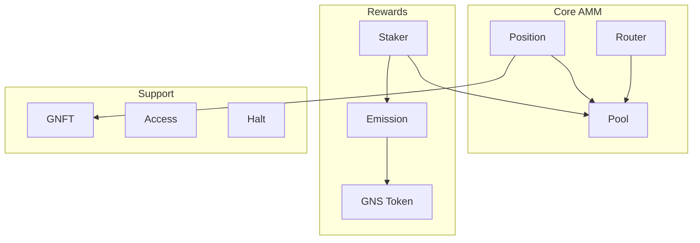

# 2. Core Contracts

## 2.1 Contract Overview

GnoSwap consists of contracts that are clearly separated by their roles.



| Contract | Role | Upgradeable |
|----------|------|-------------|
| Pool | Concentrated liquidity AMM core logic | Yes |
| Position | LP position NFT management | Yes |
| Router | Multi-hop swap routing | Yes |
| Staker | Liquidity mining rewards | Yes |
| Emission | GNS emission schedule | No |
| GNS | Governance token (GRC20) | No |
| GNFT | Position NFT (GRC721) | No |
| Access | Role-based permission management | No |
| Halt | Emergency halt system | No |

## 2.2 Pool Contract

The Pool contract is the core of GnoSwap, handling all logic for the concentrated liquidity AMM.

**Responsibilities:**

- Pool creation and initialization
- Tick-based liquidity management
- Swap execution and price calculation
- Fee accumulation and distribution
- TWAP oracle data management

**Key Functions:**

| Function | Description | Caller |
|----------|-------------|--------|
| CreatePool | Create new trading pair pool | User |
| Mint | Add liquidity | Position |
| Burn | Remove liquidity | Position |
| Swap | Token exchange | Router |
| Collect | Collect fees/principal | Position |

**Pool State Data:**

```
Pool State
├── sqrtPriceX96      Current price (Q64.96 format)
├── tick              Current tick index
├── liquidity         Active liquidity in current price range
├── feeGrowthGlobal   Global fee accumulator
├── ticks             Per-tick liquidity info (AVL Tree)
├── positions         Per-position state (AVL Tree)
└── observations      TWAP oracle data
```

**Fee Tiers:**

Pools are created with one of 4 fee tiers. Higher fees are suitable for volatile pairs.

| Fee | Tick Spacing | Use Case |
|-----|--------------|----------|
| 0.01% (100) | 1 | Stablecoin pairs |
| 0.05% (500) | 10 | Stable pairs |
| 0.3% (3000) | 60 | General pairs |
| 1% (10000) | 200 | Volatile pairs |

## 2.3 Position Contract

The Position contract manages user liquidity positions as NFTs.

**Responsibilities:**

- Liquidity position creation/modification/deletion
- Position NFT minting and metadata management
- Accumulated fee collection processing
- Position repositioning (price range change)

**Key Functions:**

| Function | Description |
|----------|-------------|
| Mint | Create new position, mint NFT |
| IncreaseLiquidity | Add liquidity to existing position |
| DecreaseLiquidity | Remove liquidity from position |
| CollectFee | Collect accumulated fees |
| Reposition | Change price range |

**Position Data:**

Each position has a unique NFT ID and contains the following information:

```
Position
├── tokenId           NFT ID
├── owner             Owner address
├── token0, token1    Pool token pair
├── fee               Fee tier
├── tickLower         Lower price tick
├── tickUpper         Upper price tick
├── liquidity         Liquidity amount
└── tokensOwed        Uncollected tokens
```

## 2.4 Router Contract

The Router contract executes swaps through optimal paths.

**Responsibilities:**

- Swap path parsing and validation
- Multi-hop swap execution
- Slippage protection
- Native GNOT wrapping/unwrapping

**Key Functions:**

| Function | Description |
|----------|-------------|
| ExactInSwapRoute | Fixed input amount swap |
| ExactOutSwapRoute | Fixed output amount swap |
| DrySwapRoute | Swap simulation (no state change) |

**Route Format:**

```
# Single-hop
"tokenIn:tokenOut:fee"
Example: "gno.land/r/demo/bar:gno.land/r/demo/baz:3000"

# Multi-hop
"token1:token2:fee1*POOL*token2:token3:fee2"
Example: "bar:baz:3000*POOL*baz:qux:500"

# Quote (ratio per path)
"30,70"  → First path 30%, second path 70%
```

## 2.5 Staker Contract

The Staker contract manages liquidity mining rewards.

**Responsibilities:**

- Position staking/unstaking
- Internal reward (GNS) calculation and distribution
- External incentive management
- Pool tier-based reward distribution

**Key Functions:**

| Function | Description |
|----------|-------------|
| StakeToken | Stake position NFT |
| UnStakeToken | Unstake and receive rewards |
| CollectReward | Collect rewards only (maintain stake) |
| MintAndStake | Create position + stake in one shot |
| CreateExternalIncentive | Create external reward pool |

**Reward Types:**

1. **Internal Rewards (GNS)**: GNS issued from Emission is distributed according to pool tier.

2. **External Incentives**: Anyone can set up custom token rewards for specific pools.

**Pool Tier System:**

Pools are classified into tiers 1-10, with higher tiers receiving more GNS rewards.

## 2.6 Supporting Contracts

**GNS Token:**

GnoSwap's governance token. Follows GRC20 standard, only Emission contract can mint.

- Initial mint: 100 trillion GNS
- Maximum supply: 1,000 trillion GNS
- Emission period: 12 years (with halving)

**GNFT:**

Position NFT contract. Follows GRC721 standard, generates dynamic SVG metadata.

**Access:**

Role-based permission management system. Manages addresses by role such as admin, governance, pool, position, etc.

**Halt:**

Emergency halt system supporting 4 halt levels:

| Level | Description |
|-------|-------------|
| None | Normal operation |
| SafeMode | Only core operations allowed |
| Emergency | Only withdrawals allowed |
| Complete | All operations halted |
