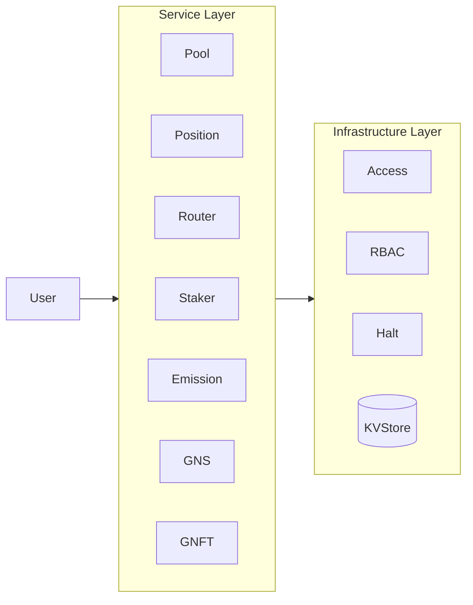
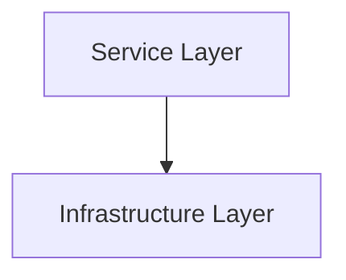
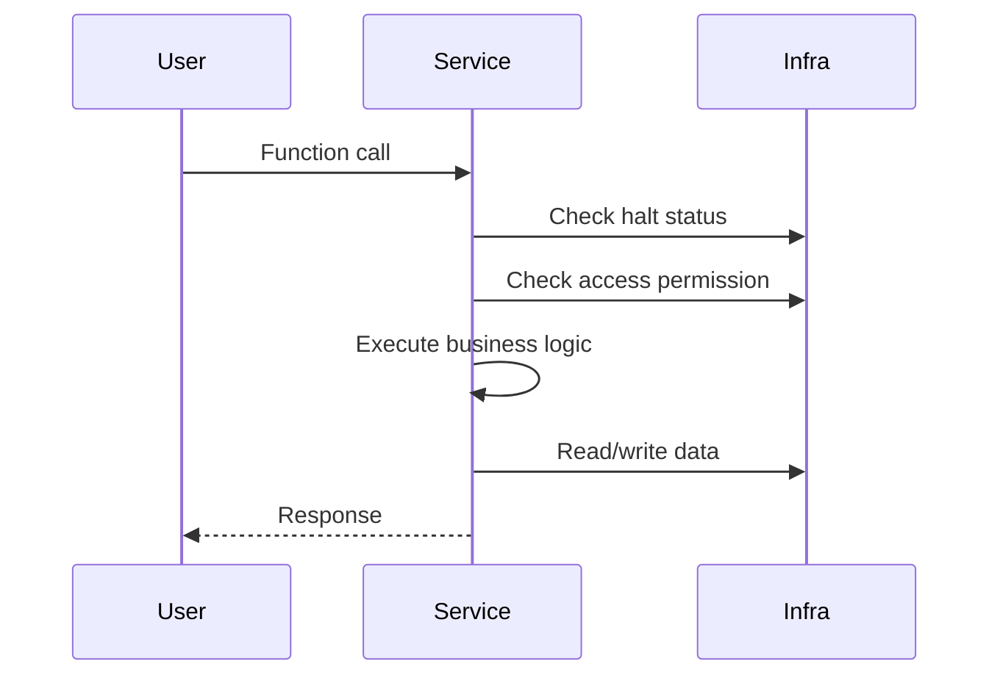

# 3. Layer Architecture

## 3.1 Two-Layer Structure

GnoSwap uses a 2-layer architecture consisting of Service and Infrastructure layers. Each layer has clear responsibilities, with the Service Layer depending on the Infrastructure Layer.

## 3.2 Service Layer

The Service Layer consists of domain contracts that process business logic.

| Contract | Responsibility |
|----------|----------------|
| Pool | Concentrated liquidity pool management, swap execution, fee accumulation |
| Position | LP position CRUD, NFT minting, fee collection |
| Router | Swap path parsing, multi-hop execution, slippage validation |
| Staker | Staking management, reward calculation, external incentives |
| Emission | GNS emission schedule management, distribution ratio calculation |
| GNS | GNS token minting/transfer/burning |
| GNFT | Position NFT minting/burning, metadata management |

**Characteristics:**

- Entry point for user requests
- Domain-specific business logic implementation
- Interaction with other Service contracts
- Utilization of Infrastructure services

## 3.3 Infrastructure Layer

The Infrastructure Layer provides base services commonly used by all Services.

| Component | Responsibility |
|-----------|----------------|
| Access | Role-based access control |
| RBAC | Role address management |
| Halt | Emergency halt system |
| KVStore | Persistent data storage |

**Characteristics:**

- Commonly used by all Services
- Provides security and stability foundation
- Independent of domain logic
- Unaware of upper layers (unidirectional dependency)

## 3.4 Layer Dependencies

**Dependency Rules:**

1. Service Layer uses data and services from the Infrastructure Layer.
2. Infrastructure Layer is unaware of the Service Layer.
3. Inter-contract calls within the Service Layer are allowed.

## 3.5 Data Flow

A typical flow for processing user requests:

**Processing Steps:**

1. **Service Layer**: Receive user request, check halt/access, execute business logic
2. **Infrastructure Layer**: Permission verification, data persistence
3. **Response**: Return result to user
