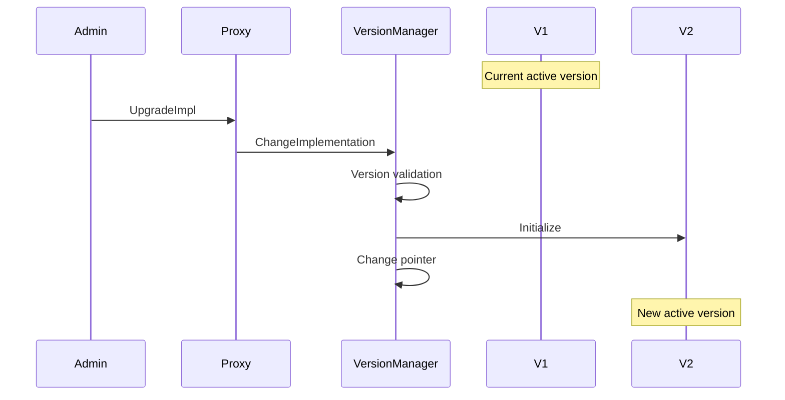
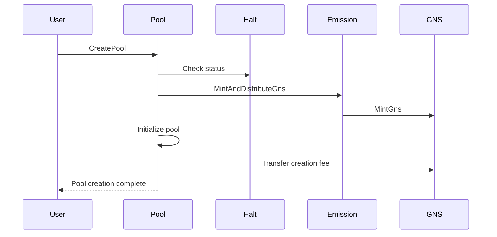
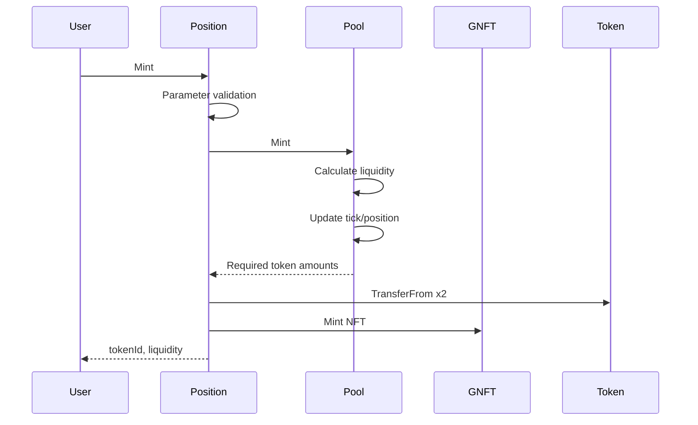
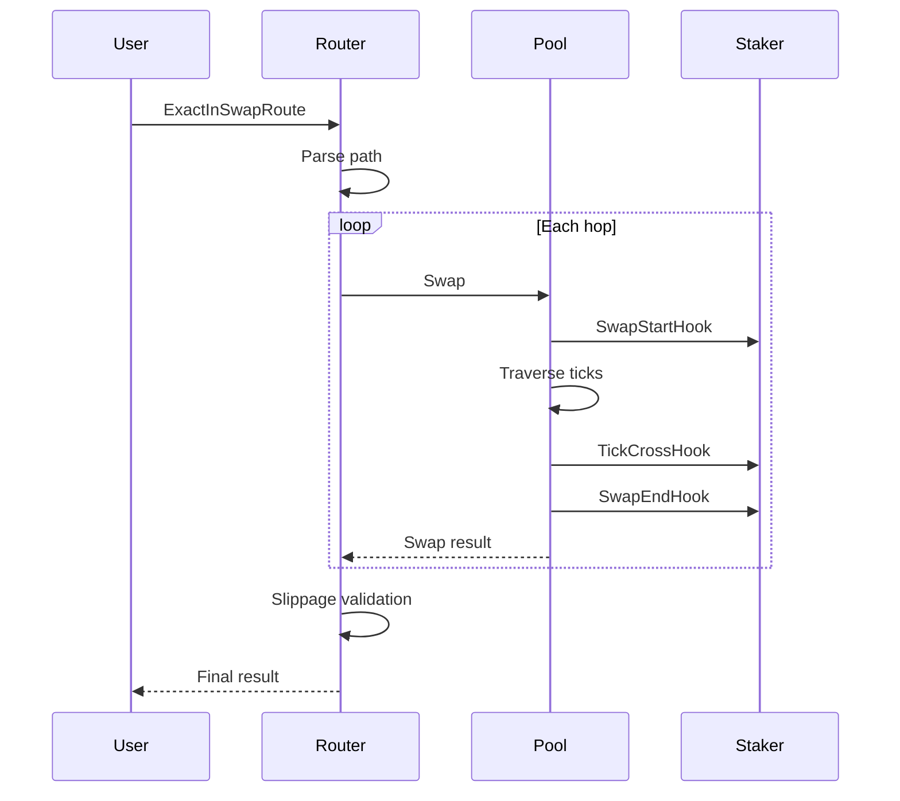
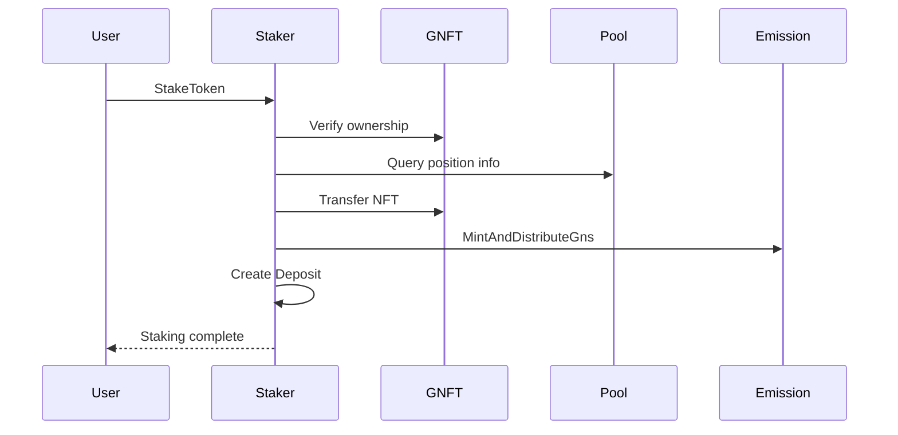
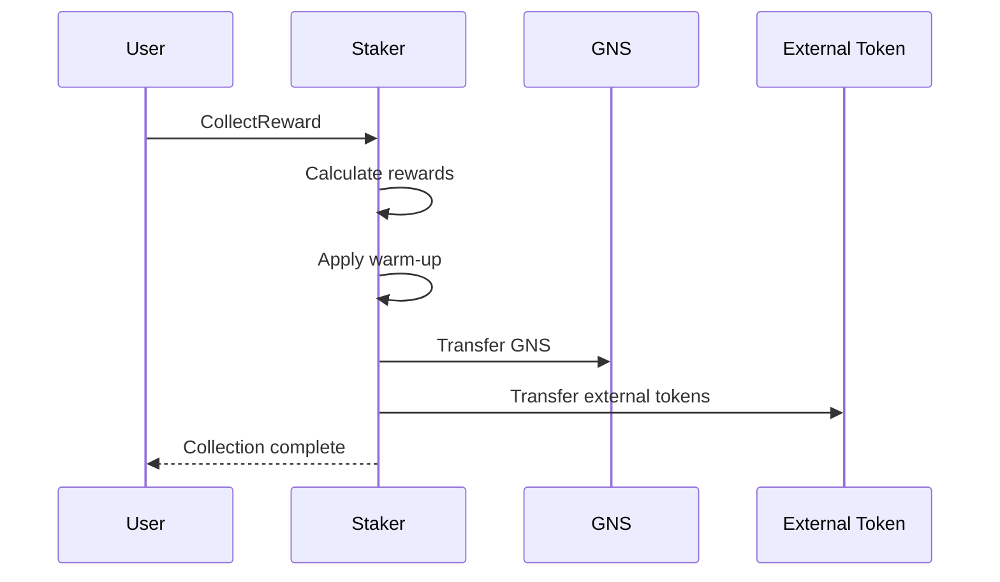
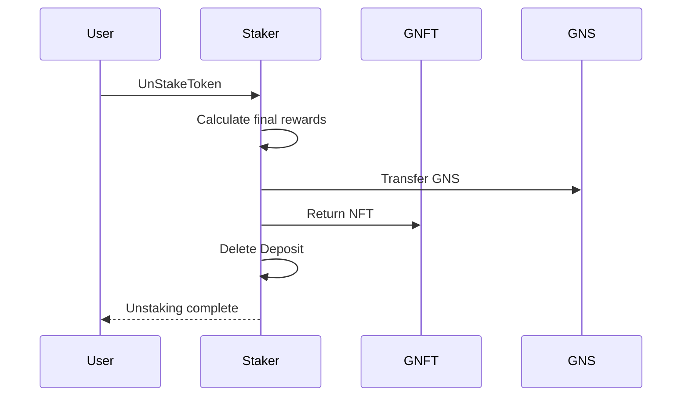

# 4. Feature Flows

## 4.1 Version Upgrade Flow

Contract upgrades proceed without service interruption.



**Upgrade Process:**

1. Admin calls `UpgradeImpl` with new version package path
2. Version Manager verifies the version is registered
3. Execute new version's initializer (using same KVStore)
4. Change `currentImplementation` pointer to new version
5. All subsequent calls are routed to new version

**Characteristics:**

- No data migration required (same storage)
- Immediate application (zero-downtime)
- Rollback to previous version possible

## 4.2 Pool Creation Flow

Process for creating a new trading pair pool.



**Creation Process:**

1. User calls `CreatePool` with token0, token1, fee, initial price
2. Check Halt status (fails if halted)
3. Trigger Emission (GNS minting and distribution)
4. Initialize pool structure:
   - Sort token order (token0 < token1)
   - Calculate initial tick from sqrtPriceX96
   - Initialize ticks, positions AVL Trees
5. Transfer pool creation fee (100 GNS)
6. Save pool to pools map

**Requirements:**

- Both tokens must be registered in GRC20 registry
- Only one pool per token pair + fee combination
- Creator must hold 100 GNS

## 4.3 Position Mint Flow

Process for creating a new liquidity position.



**Creation Process:**

1. User calls `Mint` with pool, price range, desired token amounts
2. Validate tick spacing (matches fee tier interval)
3. Call Pool.Mint:
   - Calculate maximum liquidity from token amounts
   - Update tick bitmap
   - Update position state
   - Return actual required token amounts
4. Transfer token0, token1 from user
5. Mint GNFT NFT (dynamic SVG metadata)
6. Return tokenId, liquidity, actual token amounts used

**Position Characteristics:**

- Each position has a unique NFT ID
- Price range (tickLower, tickUpper) cannot be changed
- Liquidity add/remove handled by separate functions

## 4.4 Swap Execution Flow

Process for executing token swaps.



**Swap Process:**

1. User calls with input token, output token, path, minimum output amount
2. Router parses path string (multi-hop supported)
3. Execute Pool.Swap for each hop:
   - Acquire reentrancy lock
   - SwapStartHook → Notify Staker of batch start
   - Traverse ticks consuming liquidity, update price
   - Call TickCrossHook on tick boundary crossing
   - SwapEndHook → Notify Staker of batch end
   - Handle token transfer via callback
4. Verify final output amount meets minimum
5. Return result

**Hook System:**

Notifies Staker of events during Pool swap to update reward calculations:

- `SwapStartHook`: Initialize batch processing
- `TickCrossHook`: Update accumulators on tick boundary crossing
- `SwapEndHook`: Complete batch processing

## 4.5 Staking Flow

Process for staking positions to receive rewards.



**Staking Process:**

1. User calls `StakeToken` with positionId
2. Verify ownership in GNFT
3. Query position info from Pool (liquidity, ticks)
4. Transfer NFT to Staker contract
5. Trigger Emission (GNS minting)
6. Create Deposit:
   - lpTokenId, targetPoolPath
   - liquidity, tick range
   - stakeTimestamp (for warm-up calculation)
   - Initialize reward accumulator
7. Emit staking complete event

**Deposit Data:**

```
Deposit
├── lpTokenId         Position NFT ID
├── targetPoolPath    Staked pool
├── liquidity         Liquidity amount
├── tickLower/Upper   Price range
├── stakeTimestamp    Staking start time
└── rewardState       Reward accumulation state
```

## 4.6 Collect Reward Flow

Process for collecting staking rewards.



**Reward Calculation:**

1. Query global accumulated rewards
2. Calculate accumulated rewards within position's price range
3. Apply position liquidity ratio
4. Subtract previously collected amount
5. Apply warm-up ratio (based on staking duration)
6. Transfer GNS and external tokens
7. Update lastCollectionTime

**Warm-up Period:**

To prevent gaming by new stakers, reward ratio increases with staking duration:

| Duration  | Reward Ratio |
| --------- | ------------ |
| Day 0     | 30%          |
| Days 1-7  | 50%          |
| Days 7-14 | 70%          |
| Day 14+   | 100%         |

## 4.7 Unstake Flow

Process for unstaking and reclaiming positions.



**Unstaking Process:**

1. Calculate and transfer final rewards (GNS + external tokens)
2. Return NFT to user
3. Delete Deposit data
4. Emit unstaking complete event

**Subsequent User Actions:**

To reclaim liquidity after unstaking:

1. `Position.DecreaseLiquidity` - Remove liquidity
2. `Position.CollectFee` - Collect tokens and fees
