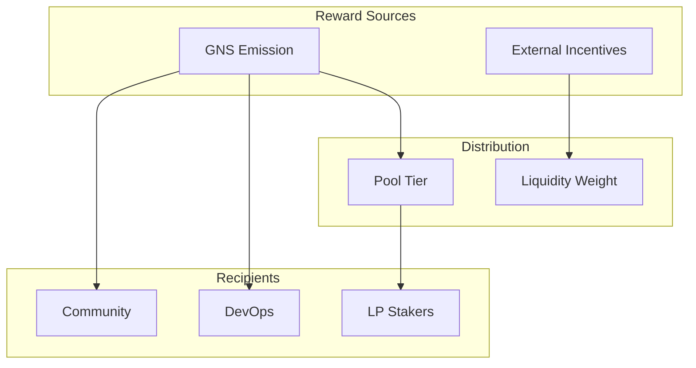
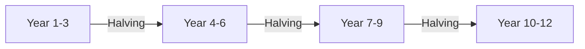
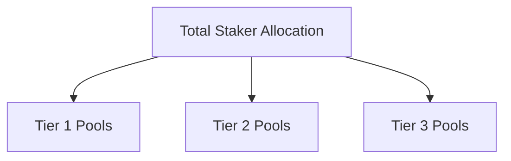
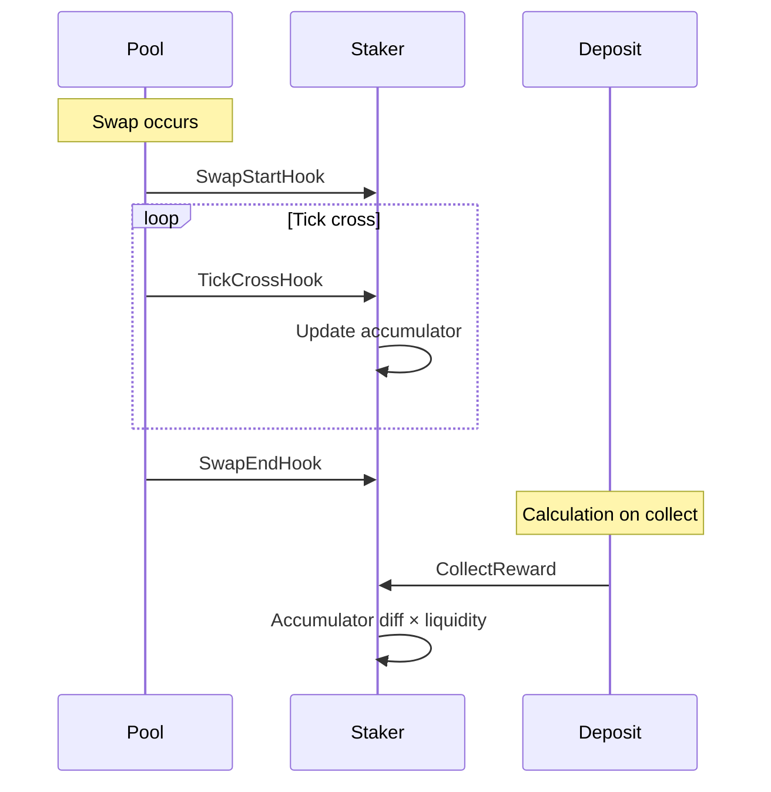
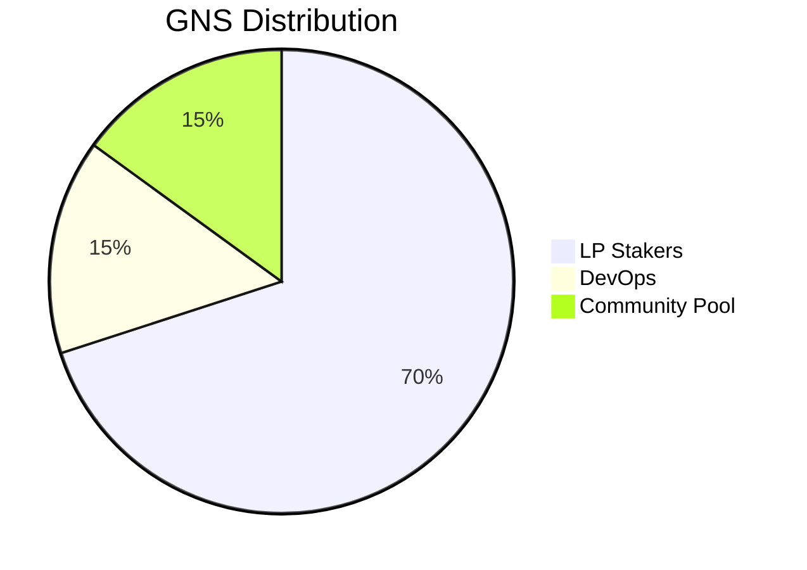
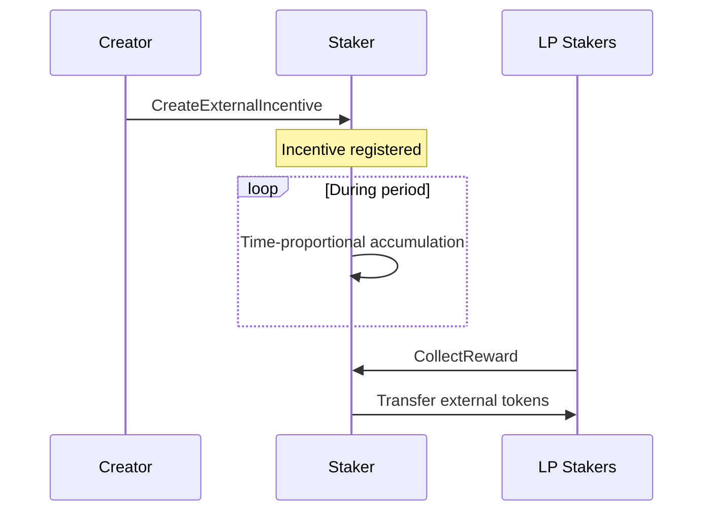

# 5. Reward Distribution

## 5.1 Reward System Overview

GnoSwap's reward system provides rewards from two sources.



**Internal Rewards (GNS):**

- Issued from Emission contract according to schedule
- Distributed to pools based on Pool Tier
- Distributed to stakers based on liquidity ratio

**External Incentives:**

- Anyone can set up custom token rewards for specific pools
- Evenly distributed over specified period
- Distributed to stakers based on liquidity ratio

## 5.2 GNS Emission Schedule

GNS is issued over 12 years with halving applied.



| Category | Amount |
|----------|--------|
| Initial Mint | 100 trillion GNS |
| Emission Pool | 900 trillion GNS |
| Maximum Supply | 1,000 trillion GNS |
| Duration | 12 years |
| Halving | ~Every 3 years |

**Emission Characteristics:**

- Time-proportional issuance per block/transaction
- 50% reduction in per-second issuance at each halving
- Undistributed amounts carry over to next distribution

## 5.3 Pool Tier System

Pools receive differential GNS rewards based on tier.



**Tier Structure:**

| Tier | Description | Reward Weight |
|------|-------------|---------------|
| Tier 1 | Core pairs | Highest |
| Tier 2 | Major pairs | Medium |
| Tier 3 | General pairs | Low |

**Distribution Logic:**

1. Determine total Staker allocation (from Emission)
2. Allocate based on tier weights
3. Equal distribution among pools within each tier
4. Distribution to stakers within pool based on liquidity ratio

## 5.4 Reward Calculation

Reward accumulators are updated during swaps.



**Calculation Formula:**

```
Individual Reward = (Current Accumulator - Previous Accumulator) × Liquidity × Warm-up Ratio
```

**Accumulator Updates:**

- `rewardPerLiquidityGlobal`: Reward per liquidity for entire pool
- `rewardPerLiquidityInside`: Reward within specific price range
- Inside value recalculated on tick boundary crossing

## 5.5 Distribution Targets

GNS Emission is distributed to multiple recipients.



| Target | Description | Distribution Method |
|--------|-------------|---------------------|
| LP Stakers | Liquidity providers | Tier × Liquidity ratio |
| DevOps | Development/Operations team | Fixed ratio |
| Community Pool | Community treasury | Fixed ratio |

**Protocol Fee Distribution:**

A portion of swap fees is collected as protocol fees:

- 0-10% of swap fees (configurable)
- Distributed to DevOps and Community Pool

## 5.6 External Incentives

External projects can provide additional rewards to specific pools.



**Incentive Settings:**

| Parameter | Description |
|-----------|-------------|
| targetPoolPath | Target pool |
| rewardToken | Reward token address |
| rewardAmount | Total reward amount |
| startTimestamp | Start time |
| endTimestamp | End time |

**Distribution Method:**

- Even distribution per second during period
- Distribution to stakers based on liquidity ratio
- Minimum reward threshold can be applied
